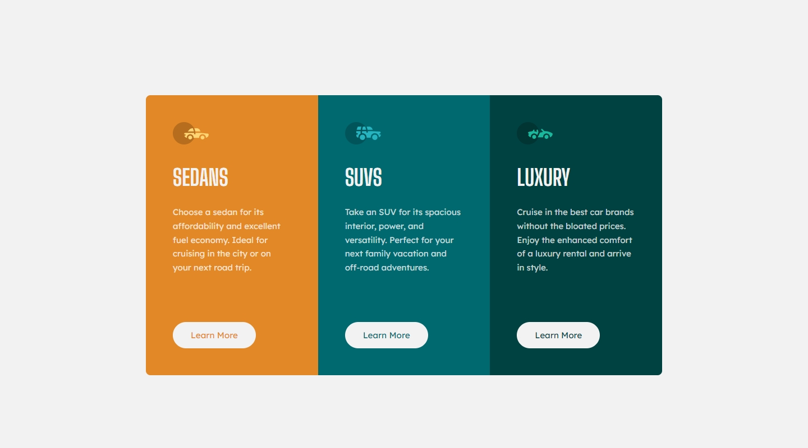
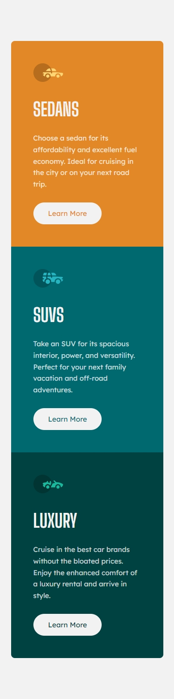

## Frontend Mentor Challenge 02 - 3-Column Preview Card Component

This is my solution to the ["3-Column Preview Card Component" challenge on Frontend Mentor](https://www.frontendmentor.io/challenges/3column-preview-card-component-pH92eAR2-).

### Screenshots of My Solution (Desktop & Mobile) 🔍

#

### Links 🔗

- Live Site URL: https://3-column-preview-card-component-darkstarxdd.vercel.app/
- Solution URL: https://www.frontendmentor.io/solutions/3column-preview-card-component-et9Z1kSS1b

#

### Note 📍

- I am aware that on some elements the WCAG color contrast ratio has not been met. But in this design, in order to fix it I would have to make some big changes to the background color on two cards, so for now I have left it as it is.

#

### Features 🎉

- Mobile Responsive 📱
- Self-hosted Fonts 🔡

#

### Built with 🔧🔨

- Grid & Flex Layouts 🔲
- Mobile First Approach 📱
- BEM Naming Convention 📚

#

### New Things I Learned 🎓📖

- How to use `grid-template-columns` property.
- Not all images need to have text in the `alt` attribute. If you use images as icons for decoration purposes, no need to describe what that image is using an `alt` attribute. In those cases set the `alt` attribute of the `img` to be null. `alt=""`.

#

### Helpful Resources 📜

- [Decorative Images - W3C](https://www.w3.org/WAI/tutorials/images/decorative/)

#

### Tools I Use 🔧

- [Prettier VS Code Extension](https://marketplace.visualstudio.com/items?itemName=esbenp.prettier-vscode) - Code formatter.

- [Responsively.app](https://responsively.app/) - A free and open source tool that allows you to test your webpage on different screen sizes, take screenshots and much more.

- [Color Contrast Checker by coolors.co](https://coolors.co/contrast-checker/112a46-acc8e5) - Check color contrast ratios and if needed, update the colors to match the WCAG guidelines.

- [google webfonts helper by Mario Ranftl](https://gwfh.mranftl.com/fonts) - Converts TTF fonts to WOFF and WOFF2 formats.

- [PerfectPixel by WellDoneCode](https://chromewebstore.google.com/detail/perfectpixel-by-welldonec/dkaagdgjmgdmbnecmcefdhjekcoceebi) - A chrome extension that enables you to overlay an image over your HTML webpage. This makes it easy to compare your HTML result with the reference image and adjust fine details if needed.

#

- My Frontend Mentor Profile - [@DarkstarXDD](https://www.frontendmentor.io/profile/DarkstarXDD)
